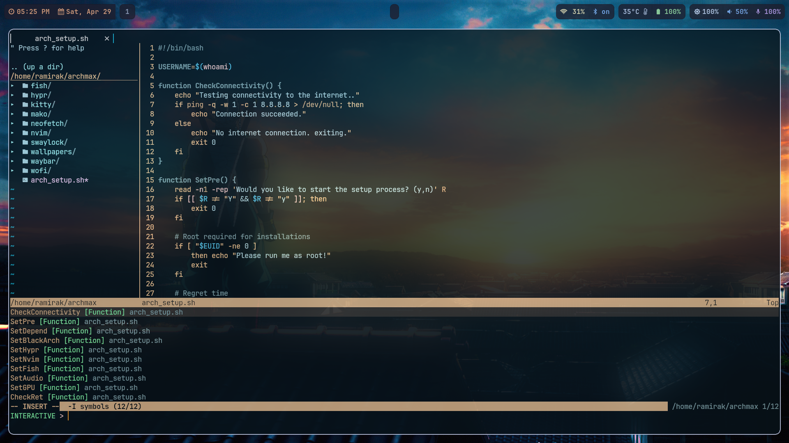

# Archmax
## Maximize your Arch Linux experience, with ready made environment for development with a great look.

## Installation
- Download the folder and run arch_setup.sh 
- The script is intended to use on a fresh Arch installation.

## Features 
- Hyprland with waybar and swaylock.
- Kitty as a terminal emulator.
- Find and run your programs with Wofi.
- Neovim with plugins for maximum development productivity, including auto-completion, tabs, file management and much more.
- Fish shell as default.
- Manage your packages with Yay.
- Blackarch repository.
- External GPU support (for amd use alias amd {command})
- Modern look and feel.

## Shortcuts examples
```
- Win + R   Run / Search
- Win + Q   Terminal
- Win + X   Close current Window
- Win + S   Take a screenshot
- Win + A   Maximize current window
- Win + Arrow keys  Navigation
- CTRL + Shift + Q   New terminal tabs
- CTRL + Shift + X   Close terminal tabs
- CTRL + Shift + Arrow keys     Terminal tabs navigation
```

## Screenshots

<p align="center">

</p>

<p align="center">

</p>
